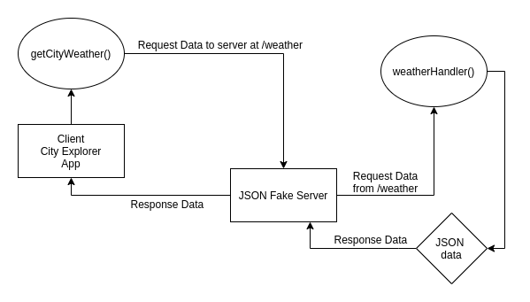

# City Explorer API

**Author**: Ben Mils 
**Version**: 1.0.0

## Overview

This API goes with the [City Explorer](https://github.com/akkanben/city-explorer) and has been used to test out serving a .json weather data file as prepwork for connecting the City Explorer app to an external API.

## Getting Started

1. Clone down the repo.
2. Enter `cd city-explorer-api` & `npm install`.
3. Create an `.env` file directly inside of the "city-explorer-api" directory and add `PORT=your-prefered-local-port`.
4. Add `REACT_APP_SERVER_URL=http://localhost:same-port-as-set-3` to your `.env` file in the "city-explorer" directory.
4. Start the app with `npm start`.

## Architecture

- HTML5, JavaScript
- Express
- Dotenv
- Cors
- [Axios](https://www.npmjs.com/package/axios)

## Change Log

11-02-2021 11:45AM - Application has working weather data and responds to correctly formatted urls at /weather.
 

## Credit and Collaborations

Collaboration with [Joe Streifel](https://github.com/jstreifel-33) during the planning phase for the web request-response cycle.

## Time Estimates

| # | Feature Name                  | Estimated Time |  Start   | Finish  | Actual |
| - | ------------------------------| -------------- | -------- | ------- | ------ |
| 1 | Set up your Server Repository | 00:30          | 05:00PM  | 05:16PM | 00:16  |
| 2 | Weather                       | 02:00          | 07:20PM  | 11:45PM | 04:25  |
| 3 | Errors                        | 02:00          | 11:45PM  | 01:00AM | 01:45  |

